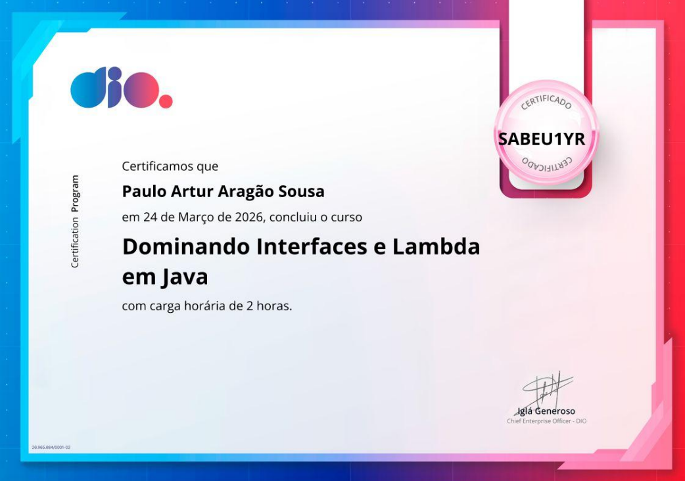

# 🚀 Java Functional Programming: Dominando Interfaces e Lambdas

Este repositório contém um projeto prático desenvolvido para consolidar os conceitos de **Programação Funcional** em Java, com foco em **Interfaces Funcionais** e **Expressões Lambda**.

## 🎓 Certificação Relacionada
O desenvolvimento deste código serviu como laboratório prático para o curso concluído na plataforma **DIO (Digital Innovation One)**:

> **Curso:** Dominando Interfaces e Lambda em Java  
> **Instituição:** DIO  
> **Conclusão:** 24 de Março de 2026  
> **Carga Horária:** 2 Horas  
> **ID de Verificação:** SABEU1YR

---

## 💻 Sobre o Projeto
O projeto simula um **Gerenciador de Pagamentos** dinâmico. Em vez de utilizar estruturas complexas de herança para cada tipo de pagamento, utilizei o poder das **Interfaces Funcionais** e **Lambdas** para injetar o comportamento de processamento em tempo de execução.

### 🛠️ Conceitos Aplicados
* **Interfaces Funcionais:** Criação de contratos de método único com `@FunctionalInterface`.
* **Expressões Lambda:** Implementação de lógica de processamento de forma concisa e legível.
* **Injeção de Comportamento:** Passagem de Lambdas como argumentos para métodos.
* **Modern Java:** Uso de recursos introduzidos a partir do Java 8 para reduzir código boilerplate.

## 📂 Como rodar o projeto
1. Clone o repositório.
2. Navegue até a pasta `src`.
3. Compile os arquivos: `javac com/paulo/pagamentos/*.java`
4. Execute a aplicação: `java com.paulo.pagamentos.GerenciadorPagamentos`

---
### Contato
Desenvolvido por **Paulo Artur Aragão Sousa** 🎓 Estudante de Ciência da Computação na **UFERSA** 📍 Mossoró - RN